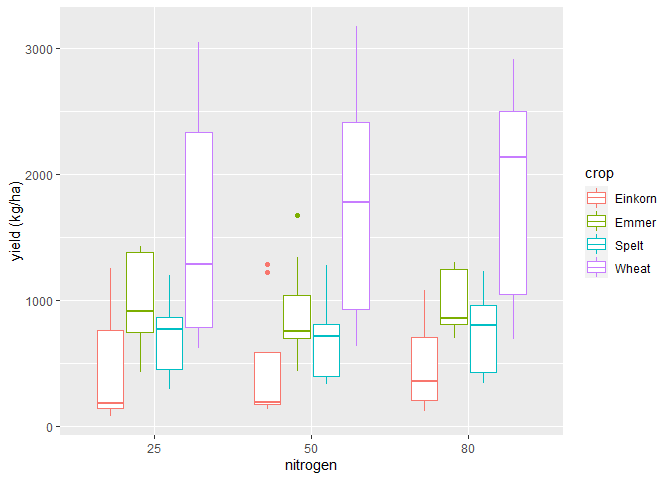
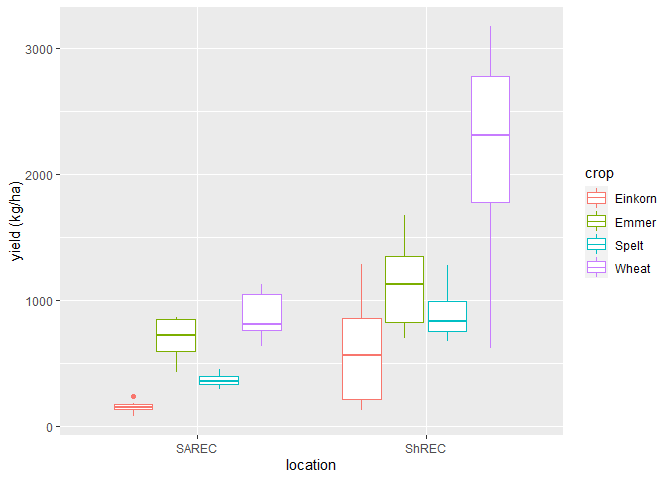
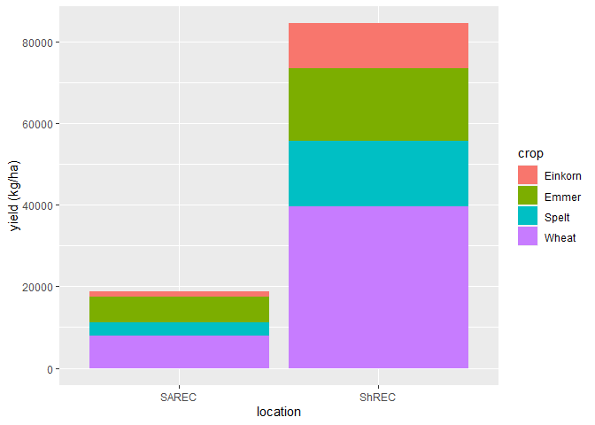

Dryland grain yield
================

# Load packages

``` r
library(readxl)
library(tidyverse)
library(pbkrtest)
```

    ## Warning: package 'pbkrtest' was built under R version 4.1.3

``` r
library(agricolae)
library(emmeans)
library(multcomp)
```

    ## Warning: package 'MASS' was built under R version 4.1.3

``` r
library(multcompView)
library(lme4)
library(lmerTest)
```

# load data

``` r
dry.grainyield <- read_excel("grain yield2.xlsx")
```

# Convert character to factors

``` r
dry.grainyield$crop<-as.factor(dry.grainyield$crop)
dry.grainyield$nitrogen<-as.factor(dry.grainyield$nitrogen)
dry.grainyield$year<-as.factor(dry.grainyield$year)
dry.grainyield$location<-as.factor(dry.grainyield$location)
```

# Summary and attaching data

``` r
summary(dry.grainyield)
```

    ##    year     location     Season               crop     Irrigation       
    ##  2019:72   SAREC:36   Length:106         Einkorn:27   Length:106        
    ##  2020:34   ShREC:70   Class :character   Emmer  :25   Class :character  
    ##                       Mode  :character   Spelt  :27   Mode  :character  
    ##                                          Wheat  :27                     
    ##                                                                         
    ##                                                                         
    ##       Plot       nitrogen yield (kg/ha)        twt (kg)     actual N (kg/ha)
    ##  Min.   :101.0   25:36    Min.   :  85.86   Min.   :25.13   Min.   :22.90   
    ##  1st Qu.:133.5   50:35    1st Qu.: 441.26   1st Qu.:26.52   1st Qu.:28.00   
    ##  Median :209.5   80:35    Median : 809.00   Median :27.17   Median :56.00   
    ##  Mean   :216.2            Mean   : 974.78   Mean   :27.13   Mean   :57.58   
    ##  3rd Qu.:304.8            3rd Qu.:1241.47   3rd Qu.:27.56   3rd Qu.:89.60   
    ##  Max.   :342.0            Max.   :3175.99   Max.   :29.33   Max.   :92.01

``` r
attach(dry.grainyield)
```

# subset the file by crop

``` r
einkorn <- subset(dry.grainyield, crop=='Einkorn')
emmer <- subset(dry.grainyield, crop=='Emmer')
spelt <- subset(dry.grainyield, crop=='Spelt')
```

# subset the file by location

``` r
SAREC <- subset(dry.grainyield, location=='SAREC')
ShREC <- subset(dry.grainyield, location=='ShREC')
```

# Anova by crop

``` r
fit <- lmer(`yield (kg/ha)` ~ location*nitrogen + (1 | year), data = einkorn)
anova(fit)
```

    ## Type III Analysis of Variance Table with Satterthwaite's method
    ##                   Sum Sq Mean Sq NumDF  DenDF F value Pr(>F)
    ## location           61400   61400     1 20.162  1.7207 0.2043
    ## nitrogen             351     176     2 20.000  0.0049 0.9951
    ## location:nitrogen   4699    2349     2 20.000  0.0658 0.9365

``` r
ranova(fit)
```

    ## ANOVA-like table for random-effects: Single term deletions
    ## 
    ## Model:
    ## `yield (kg/ha)` ~ location + nitrogen + (1 | year) + location:nitrogen
    ##            npar  logLik    AIC    LRT Df Pr(>Chisq)    
    ## <none>        8 -146.24 308.49                         
    ## (1 | year)    7 -158.19 330.39 23.901  1  1.014e-06 ***
    ## ---
    ## Signif. codes:  0 '***' 0.001 '**' 0.01 '*' 0.05 '.' 0.1 ' ' 1

``` r
fit3 <- lmer(`yield (kg/ha)` ~ location*nitrogen + (1 | year), data = emmer)
anova(fit3)
```

    ## Type III Analysis of Variance Table with Satterthwaite's method
    ##                   Sum Sq Mean Sq NumDF  DenDF F value  Pr(>F)  
    ## location          416319  416319     1 18.945  6.1416 0.02279 *
    ## nitrogen           33854   16927     2 18.011  0.2497 0.78168  
    ## location:nitrogen  51787   25894     2 18.011  0.3820 0.68790  
    ## ---
    ## Signif. codes:  0 '***' 0.001 '**' 0.01 '*' 0.05 '.' 0.1 ' ' 1

``` r
ranova(fit3)
```

    ## ANOVA-like table for random-effects: Single term deletions
    ## 
    ## Model:
    ## `yield (kg/ha)` ~ location + nitrogen + (1 | year) + location:nitrogen
    ##            npar  logLik    AIC   LRT Df Pr(>Chisq)
    ## <none>        8 -137.65 291.30                    
    ## (1 | year)    7 -138.83 291.66 2.366  1      0.124

``` r
fit5 <- lmer(`yield (kg/ha)` ~ location*nitrogen + (1 | year), data = spelt)
anova(fit5)
```

    ## Type III Analysis of Variance Table with Satterthwaite's method
    ##                    Sum Sq Mean Sq NumDF  DenDF F value    Pr(>F)    
    ## location          1464960 1464960     1 12.701 48.9694 1.062e-05 ***
    ## nitrogen             7801    3900     2 20.000  0.1304    0.8785    
    ## location:nitrogen    1978     989     2 20.000  0.0331    0.9675    
    ## ---
    ## Signif. codes:  0 '***' 0.001 '**' 0.01 '*' 0.05 '.' 0.1 ' ' 1

``` r
ranova(fit5)
```

    ## ANOVA-like table for random-effects: Single term deletions
    ## 
    ## Model:
    ## `yield (kg/ha)` ~ location + nitrogen + (1 | year) + location:nitrogen
    ##            npar  logLik    AIC     LRT Df Pr(>Chisq)
    ## <none>        8 -142.51 301.02                      
    ## (1 | year)    7 -142.54 299.08 0.05649  1     0.8121

# Anova by location

``` r
fit9 <- lm(`yield (kg/ha)` ~ crop, data = SAREC)
anova(fit9)
```

    ## Analysis of Variance Table
    ## 
    ## Response: yield (kg/ha)
    ##           Df  Sum Sq Mean Sq F value    Pr(>F)    
    ## crop       3 2796045  932015  56.638 6.748e-13 ***
    ## Residuals 32  526584   16456                      
    ## ---
    ## Signif. codes:  0 '***' 0.001 '**' 0.01 '*' 0.05 '.' 0.1 ' ' 1

``` r
crop.cld<-cld(emmeans(fit9, ~crop), Letters=LETTERS, reverse=TRUE) 
crop.cld
```

    ##  crop    emmean   SE df lower.CL upper.CL .group
    ##  Wheat      875 42.8 32    787.9      962  A    
    ##  Emmer      695 42.8 32    607.4      782   B   
    ##  Spelt      371 42.8 32    283.9      458    C  
    ##  Einkorn    157 42.8 32     69.5      244     D 
    ## 
    ## Confidence level used: 0.95 
    ## P value adjustment: tukey method for comparing a family of 4 estimates 
    ## significance level used: alpha = 0.05 
    ## NOTE: Compact letter displays can be misleading
    ##       because they show NON-findings rather than findings.
    ##       Consider using 'pairs()', 'pwpp()', or 'pwpm()' instead.

``` r
fit10 <- lmer(`yield (kg/ha)` ~ crop + (1 | year), data = ShREC)
anova(fit10)
```

    ## Type III Analysis of Variance Table with Satterthwaite's method
    ##        Sum Sq Mean Sq NumDF  DenDF F value    Pr(>F)    
    ## crop 25776774 8592258     3 65.005  54.113 < 2.2e-16 ***
    ## ---
    ## Signif. codes:  0 '***' 0.001 '**' 0.01 '*' 0.05 '.' 0.1 ' ' 1

``` r
ranova(fit10)
```

    ## ANOVA-like table for random-effects: Single term deletions
    ## 
    ## Model:
    ## `yield (kg/ha)` ~ crop + (1 | year)
    ##            npar  logLik    AIC    LRT Df Pr(>Chisq)    
    ## <none>        6 -496.17 1004.4                         
    ## (1 | year)    5 -504.94 1019.9 17.533  1  2.823e-05 ***
    ## ---
    ## Signif. codes:  0 '***' 0.001 '**' 0.01 '*' 0.05 '.' 0.1 ' ' 1

``` r
crop.cld1<-cld(emmeans(fit10, ~crop), Letters=LETTERS, reverse=TRUE) 
crop.cld1
```

    ##  crop    emmean  SE   df lower.CL upper.CL .group
    ##  Wheat     2196 254 1.24      127     4266  A    
    ##  Emmer     1135 256 1.28     -829     3099   B   
    ##  Spelt      901 254 1.24    -1169     2971   BC  
    ##  Einkorn    611 254 1.24    -1459     2681    C  
    ## 
    ## Degrees-of-freedom method: kenward-roger 
    ## Confidence level used: 0.95 
    ## P value adjustment: tukey method for comparing a family of 4 estimates 
    ## significance level used: alpha = 0.05 
    ## NOTE: Compact letter displays can be misleading
    ##       because they show NON-findings rather than findings.
    ##       Consider using 'pairs()', 'pwpp()', or 'pwpm()' instead.

# Visualize the data

``` r
dry.grainyield %>% 
  ggplot(mapping=aes(y=`yield (kg/ha)`,x=nitrogen,color=crop))+
  geom_boxplot()
```

<!-- -->

``` r
dry.grainyield %>% 
  ggplot(mapping=aes(y=`yield (kg/ha)`,x=location,color=crop))+
  geom_boxplot()
```

<!-- -->

``` r
dry.grainyield %>% 
  ggplot(mapping=aes(y=`yield (kg/ha)`,x=location))+
  geom_col(aes(fill=crop))
```

<!-- -->
